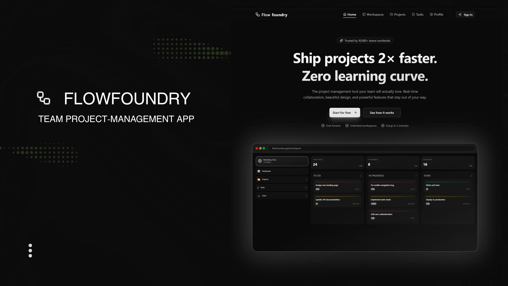

# Flowfoundry - Project Management Application



A modern, **100% free and open-source** project management application built with Next.js 16, Supabase, and TypeScript. Features real-time collaboration, drag-and-drop task management, workspace chat, and a beautiful theme-aware interface.

**🎉 Completely Free Forever** - No pricing tiers, no credit card required, unlimited workspaces, projects, and team members.

## ✨ Features

### Core Functionality
- **User Authentication** - Secure sign-up, login, and password recovery with Supabase Auth
- **Workspaces** - Multi-tenant architecture with workspace management
  - Create and manage workspaces
  - Invite team members via email
  - Leave workspace functionality
  - Back navigation to workspaces list
- **Projects** - Organize work into projects with full CRUD operations
  - Create, edit, and delete projects
  - Project descriptions and metadata
  - Navigate back to projects list
- **Kanban Board** - Drag-and-drop task management with status columns (To Do, In Progress, Done)
  - Visual drag-and-drop interface
  - Permission-based task movement (assignees only)
  - Real-time task updates
  - Back navigation to projects
- **Task Management** - Create, assign, and track tasks with:
  - Priority levels (P1-P5) with color coding
  - Due date tracking with smart categorization (Overdue, Today, Next Week)
  - Multi-assignee support
  - Task filtering by due date
  - Real-time status updates
  - Optimistic UI updates
- **Messaging System** - In-app chat with threads and real-time messaging
  - Thread-based conversations
  - Real-time message delivery
  - Unread message counts per thread
  - Message editing and deletion with confirmation dialogs
  - Thread title editing
  - Participant management
  - Delete chat and leave conversation with confirmation
  - Back navigation to workspaces
  - TanStack Query for optimistic updates
- **Notifications** - Comprehensive notification system with:
  - Real-time in-app notifications
  - Notification bell with unread count badge
  - Message notifications with navigation
  - Task assignment notifications
  - Workspace invitation notifications
  - Mark as read functionality
  - Polling fallback for reliability
  - Responsive design for mobile devices
- **User Profiles** - Customizable profiles with:
  - Avatar upload to Supabase Storage
  - Full name and job title
  - Email display
  - Theme preferences (Light/Dark/System)
  - Notification preferences
  - Real-time profile updates
- **People Management** - View and manage workspace members
  - Member list with roles
  - Search functionality
  - Remove members (admin only)
  - Leave workspace option
  - Back navigation to workspaces

### UI/UX
- **Responsive Design** - Mobile-first interface optimized for all devices
  - Adaptive layouts for mobile, tablet, and desktop
  - Mobile-optimized notification bell (full-width on small screens)
  - Responsive navigation with back buttons
  - Optimized for 400px width devices (Samsung Galaxy S20 Ultra)
  - Flexible button layouts that wrap on small screens
  - Hidden sidebars on mobile for better space utilization
- **Dark/Light Mode** - Full theme support with:
  - System preference detection
  - Instant theme switching
  - Consistent theme variables throughout
  - Smooth theme transitions
- **Modern UI** - Built with shadcn/ui components and Tailwind CSS
  - Clean, professional design
  - Consistent spacing and typography
  - Polished component library
- **Smooth Animations** - Polished transitions and interactions
  - Hover states and visual feedback
  - Loading states and skeletons
  - Optimistic UI updates
- **Accessible** - WCAG AA compliant with proper contrast ratios
- **Navigation** - Intuitive back buttons throughout the app
  - Messages → Workspaces
  - People → Workspaces  
  - Tasks → Projects

## 🛠️ Tech Stack

### Frontend
- **Framework**: Next.js 16 (App Router)
- **Language**: TypeScript 5
- **UI Library**: React 19
- **Styling**: Tailwind CSS 4
- **UI Components**: shadcn/ui (Radix UI primitives)
- **Form Handling**: React Hook Form + Zod validation
- **State Management**: 
  - React Context (Auth, Theme)
  - TanStack Query (Server state)
  - Local Storage (User preferences)
- **Icons**: Lucide React + React Icons
- **Drag & Drop**: @dnd-kit/core
- **Notifications**: Sonner (Toast notifications)
- **Theme**: next-themes

### Backend
- **Database**: Supabase (PostgreSQL)
- **Authentication**: Supabase Auth with Row Level Security (RLS)
- **Storage**: Supabase Storage (Avatar uploads)
- **Real-time**: Supabase Real-time subscriptions
- **API**: Next.js API Routes (App Router)

### Development
- **Type Safety**: TypeScript with strict mode
- **Code Quality**: ESLint
- **Package Manager**: npm

## Project Structure

```
Project-Management-App/
├── app/                          # Next.js app directory
│   ├── (pages)/                  # Route groups
│   │   ├── (auth)/              # Authentication pages
│   │   │   ├── login/
│   │   │   ├── register/
│   │   │   └── forgot-password/
│   │   └── profile/             # User profile page
│   ├── actions/                 # Server actions
│   ├── api/                     # API routes
│   ├── context/                 # React context providers
│   ├── providers/               # App-level providers
│   ├── projects/                # Projects pages
│   ├── tasks/                   # Tasks pages
│   ├── workspaces/              # Workspaces pages
│   └── layout.tsx               # Root layout
├── components/                   # React components
│   ├── chat/                    # Chat/messaging components
│   ├── notifications/           # Notification components
│   ├── profile/                 # Profile-related components
│   ├── projects/                # Project components
│   ├── providers/               # Component providers
│   ├── ui/                      # shadcn/ui components
│   └── workspaces/              # Workspace components
├── hooks/                       # Custom React hooks
├── lib/                         # Utility functions
│   ├── notifications/           # Notification utilities
│   ├── clipboard.ts             # Clipboard helper
│   ├── time.ts                  # Time formatting utilities
│   ├── useLocalStorage.ts       # Local storage hook
│   └── utils.ts                 # General utilities
├── types/                       # TypeScript type definitions
│   ├── profile.ts               # Profile-related types
│   └── workspaces.ts            # Workspace types
├── utils/                       # Utility functions
│   └── supabase/                # Supabase client utilities
└── public/                      # Static assets

```

## Getting Started

### Prerequisites

- Node.js 18+ and npm
- A Supabase account and project

### Installation

1. Clone the repository:
```bash
git clone <repository-url>
cd Project-Management-App
```

2. Install dependencies:
```bash
npm install
```

3. Set up environment variables:
Copy `env.example` to `.env.local` and fill in your Supabase credentials:
```bash
cp env.example .env.local
```
Then edit `.env.local` with your actual values from your Supabase project settings.

4. Run the development server:
```bash
npm run dev
```

5. Open [http://localhost:3000](http://localhost:3000) in your browser.

## 🔑 Key Features Explained

### Authentication & Security
- **Supabase Auth** - Enterprise-grade authentication
- **Email/Password** - Secure credential-based login
- **Password Recovery** - Email-based password reset flow
- **Protected Routes** - Middleware-based route protection
- **Session Management** - Automatic session refresh and validation
- **Confirmation Dialogs** - Safe deletion with user confirmation for chats, messages, and conversations

### Workspaces
- **Multi-tenant Architecture** - Isolated data per workspace
- **Role-based Access Control** - Owner, Admin, Member, Viewer roles
- **Invite System** - Email-based workspace invitations with accept/decline
- **Member Management** - Add, remove, and manage team members
- **Unlimited Workspaces** - Create as many workspaces as you need
- **Real-time Updates** - Live workspace data synchronization

### Projects
- **Nested Structure** - Projects organized within workspaces
- **Full CRUD Operations** - Create, Read, Update, Delete
- **Project Details** - Name, description, and metadata
- **Access Control** - Workspace-level permissions
- **Project Management** - Edit and delete projects (archive removed)
- **Navigation** - Link to task board for each project
- **Workspace Switching** - Create and switch between workspaces

### Kanban Task Board
- **Drag & Drop** - Intuitive task movement between columns
- **Three Status Columns** - To Do, In Progress, Done
- **Visual Feedback** - Hover states and drop indicators
- **Assignee-only Drag** - Only assigned users can move tasks
- **Real-time Sync** - Instant updates across all users
- **Optimistic Updates** - Immediate UI feedback

### Task Management
- **Quick Add** - Fast task creation with inline form
- **Multi-assignee Support** - Assign tasks to multiple team members
- **Assignee Selection** - Searchable user dropdown
- **Priority Levels** - P1 (High) to P5 (Low) with color coding
- **Due Dates** - Date picker with smart categorization:
  - Overdue (red badge)
  - Due Today (amber badge)
  - Next Week (blue badge)
  - No Due Date (neutral badge)
- **Inline Editing** - Edit tasks directly in the board
- **Filtering** - Filter by due date category
- **Permission Control** - Only workspace owners/admins can create tasks; assignees can move their tasks

### Notifications
- **Real-time System** - Custom-built notification system with Supabase
- **Notification Bell** - Responsive dropdown with unread count badge
  - Full-width on mobile devices
  - Fixed positioning for better UX
  - Polling fallback (10-second intervals when open)
- **Notification Fanout API** - Server-side notification distribution
- **Notification Types**:
  - Message notifications (new messages)
  - Task assignments
  - Task updates
  - Workspace invites
- **Actions**:
  - Mark as read functionality
  - Mark all as read
  - Clear all notifications
  - Manual refresh button
  - Click-outside to close
- **Profile Page** - Full notification history with responsive controls
- **ID Handling** - Supports both numeric and string notification IDs

### Messaging System
- **Thread-based Chat** - Organized conversations in workspaces
- **Real-time Messages** - Instant message delivery using Supabase subscriptions
- **Message Panel** - Dedicated chat interface with TanStack Query
- **Thread List** - View all conversations with unread counts
- **Unread Tracking** - Smart unread message counts using `last_read_at` timestamps
- **Thread Management** - Create, edit titles, and delete threads
- **Participant System** - Add/remove participants from threads
- **Optimistic Updates** - Immediate UI feedback for better UX
- **Back Navigation** - Easy navigation back to workspaces list

### Profile Management
- **Avatar Upload** - Image upload to Supabase Storage (2MB limit)
- **Profile Fields**:
  - Job title
  - Display name
  - Email (read-only)
- **Theme Preferences** - Light/Dark/System mode selection
- **Instant Updates** - Changes apply immediately
- **Real-time Sync** - Profile updates across all sessions

### Theme System
- **Three Modes** - Light, Dark, System
- **Instant Switching** - No page reload required
- **Persistent** - Saved to local storage
- **Consistent Variables** - Theme tokens throughout app
- **WCAG AA Compliant** - Proper contrast ratios
- **Smooth Transitions** - Animated theme changes

## 💻 Development

### Code Style
- **TypeScript** - Strict mode enabled for type safety
- **ESLint** - Code linting with Next.js config
- **Consistent Structure** - Organized component patterns
- **Professional Comments** - JSDoc-style documentation throughout
- **Clean Code** - Production-ready with minimal debug logging
- **Optimized Performance** - CSS transitions over heavy animations for smooth 60fps

### Component Organization
- **Reusable UI** - `components/ui/` (shadcn/ui components)
- **Feature Components** - Dedicated folders per feature
- **Server Components** - Default for better performance
- **Client Components** - Marked with `"use client"` directive
- **Colocation** - Related files grouped together

### State Management
- **React Context** - Global state (auth, theme)
- **TanStack Query** - Server state with caching
- **Local State** - useState/useReducer for component state
- **Local Storage** - User preferences persistence
- **Optimistic Updates** - Immediate UI feedback

### Theme System
- **CSS Variables** - Theme tokens in `globals.css`
- **Tailwind Classes** - `text-foreground`, `bg-background`, etc.
- **next-themes** - Theme provider with system detection
- **No Hardcoded Colors** - All colors use theme variables
- **Dark Mode First** - Designed for both modes from start

## Deployment

The application can be deployed to Vercel, Netlify, or any platform that supports Next.js:

1. Build the application:
```bash
npm run build
```

2. Set environment variables in your deployment platform

3. Deploy using your platform's CLI or dashboard


## 📄 License

MIT License - See [LICENSE](LICENSE) file for details.

## 🤝 Contributing

Contributions are welcome! Please feel free to submit a Pull Request.

## 📧 Contact

For questions or support, please open an issue on GitHub.

